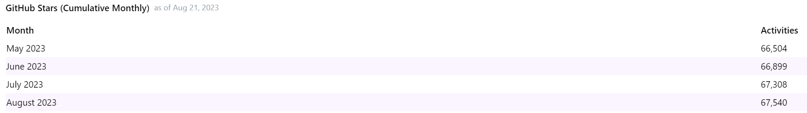
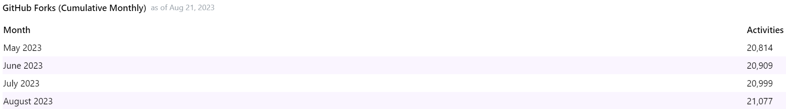
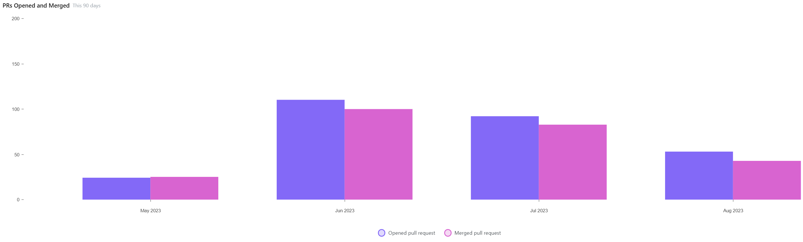
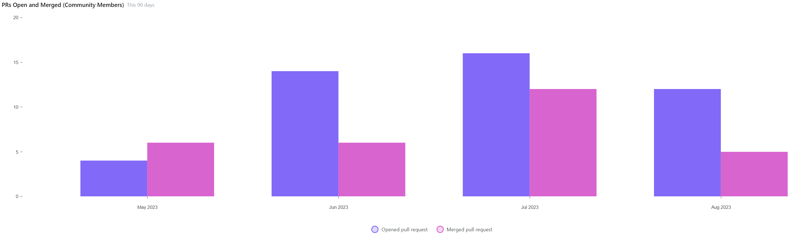
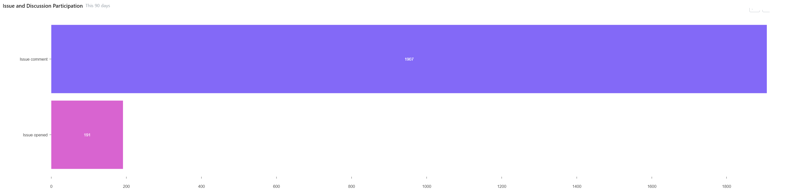
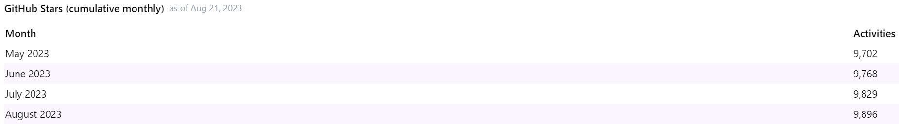
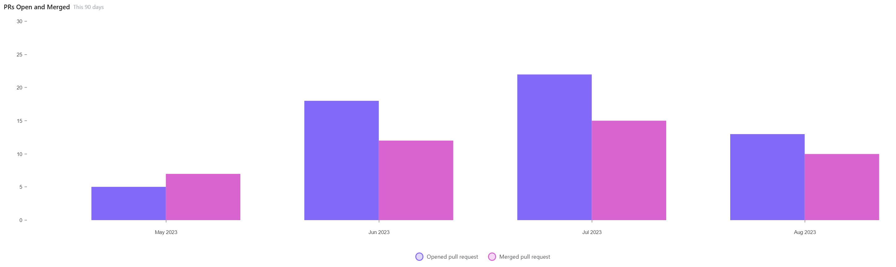
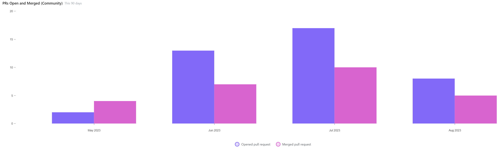
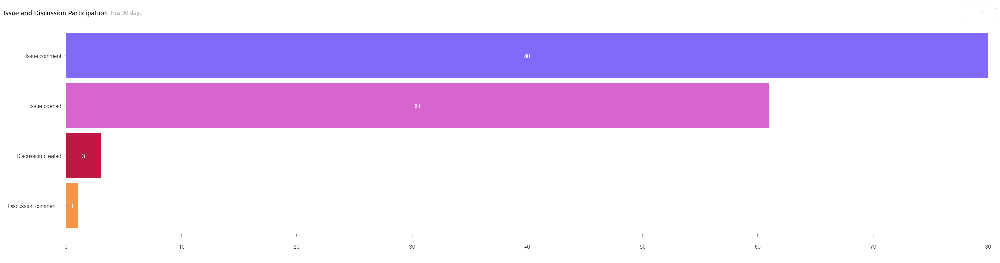
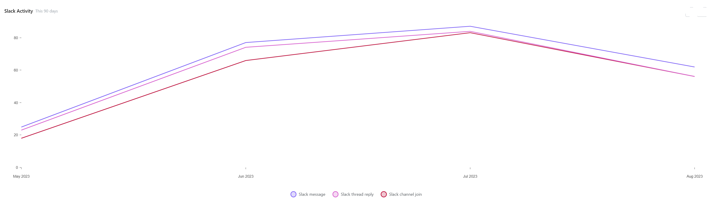

# open-source-metrics
Various metrics on some of our open source project - _Work-in-Progress_

📅 Extracted on March 15th 2023

# Swagger Projects Combined

For full information on the Swagger open source projects, check out the [Swagger](https://github.com/swagger-api) GitHub Org.

## GitHub Stars ⭐

## GitHub Forks 

## PRs Opened & Merged

## PRs Opened & Merged (Community)

## Issue & Discussion Participation

# Pact / PactFlow Projects Combined

For full information on the Pact open source projects, check out the [Pact](https://github.com/pact-foundation) GitHub Org. 

For PactFlow's open source projects, head over to [PactFlow](https://github.com/pactflow) GitHub Org.

## GitHub Stars ⭐

## GitHub Forks 

## PRs Opened & Merged

## PRs Opened & Merged (Community)

## Issue & Discussion Participation

## Slack Activity

